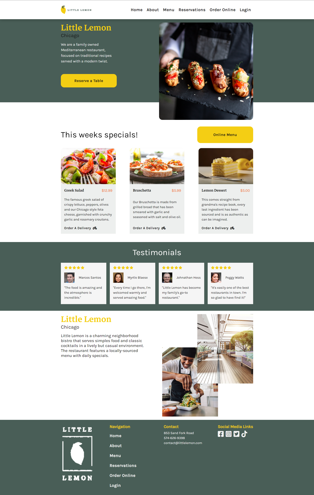

# Frontend Architecture Basic Example <!-- omit in toc -->

This project was created to be an example of what I consider a good frontend architecture for basic projects.


[](https://codecov.io/gh/inkasadev/frontend-architecture-basic-example)
[](https://opensource.org/licenses/MIT)

<p align="center" >
    
</p>

## Summary <!-- omit in toc -->

- [Technologies Used](#technologies-used)
- [Architecture and Directories](#architecture-and-directories)
- [Local Configuration](#local-configuration)
- [Testing](#testing)
- [Storybook Documentation](#storybook-documentation)
- [Possible Improvements](#possible-improvements)
- [Authors](#authors)
- [License](#license)

## Technologies Used

- [HTML](https://developer.mozilla.org/en-US/docs/Web/HTML) & [CSS](https://developer.mozilla.org/en-US/docs/Web/CSS)
- [Javascript](https://developer.mozilla.org/en-US/docs/Web/JavaScript)
- [React](https://react.dev/)
- [Create React App](https://create-react-app.dev/)
- [Storybook](https://storybook.js.org/) for component documentation
- [Jest](https://jestjs.io/pt-BR/) for testing
- [React Testing Library](https://testing-library.com/docs/react-testing-library/intro/) for testing
- [NPM](https://www.npmjs.com/)
- [Github Actions](https://docs.github.com/en/actions) for CI/CD

## Architecture and Directories

This project uses a folder structure based on the [Atomic Design](https://atomicdesign.bradfrost.com/chapter-2/), by Brad Frost. I love this philosophy and find it’s a really useful way to think about components that make up our applications.

```
Project
├── .github
│   ├── workflows: Github Actions workflows
│   .husky: Husky Hooks config
│   .storybook: Storybook config
├── src
│   ├── api: Project mock api
│   ├── assets: Project assets
│   ├── components
|   |   ├── atoms:  Inspired by the naming in Atomic Design, I generally call my foundational components atoms. These are things like buttons, headings, text, and things that don’t stand up so well on their own,but are necessary for the success of the other elements in our application.
|   |   ├── patterns: These components are reusable UI patterns that are composed from the atom-level components.
|   |   ├── screens: These components represent our pages or screens in an application.
│   ├── App.js: Main application component.
│   ├── index.js: EntryPoint of application.
│   ├── Routes.js: Application routes.
│   ├── setupTests.js: Tests configuration
│   ├── theme.css:
|── .eslintrc: ESLint project configuration.
|── .gitignore: Specifies files to Git ignore
|── .prettierrc: Prettier project configuration.
|── jsconfig.json: JS config configuration.
├── package.json: File that manages all the dependecies and contains script definitions.
```
The Atoms, Patterns and Screens naming schema is also based on the [Ryan Lanciaux](https://ryanlanciaux.com/) works.

## Local Configuration

After cloning the project, enter in the project root and run the following command:

```sh
$ npm run setup
```

- By default the application will be started at port 3000.
- You can also see the application in production [clicking here](https://frontend-architecture-basic-example.surge.sh/).

## Testing

Use the following command to run it:

```sh
$ npm run test:coverage
```

- After the test finishes a folder called COVERAGE will be generated in project root.
- Open coverage/lcov-report/index.html file to check coverage visually.
- You can also see the coverage report online [clicking here](https://app.codecov.io/gh/inkasadev/frontend-architecture-basic-example).

## Storybook Documentation

This project uses Storybook for component documentation, allowing you to check in details each component in the project. Run the following command to access it:

```sh
$ npm run sb:dev
```

- By default the storybook will be started at port 6006.
- You can also see the storybook documentation online [clicking here](https://inkasadev.github.io/frontend-architecture-basic-example).

## Possible Improvements

A system is never perfect and there is always room for improvement. Here are some points that I would like to enhance if I had more time:

- Rewrite the project using [Typescript](https://www.typescriptlang.org/)
- Use [Vite](https://vitejs.dev/) rather than CRA
- Use a form library like [React Hook Form](https://react-hook-form.com/) for form validation.

## Authors

|  |
| :----------------------------------------------------------------------------: |
|               [Phillipe Martins](https://github.com/inkasadev/)                |

See also the list of
[contributors](https://github.com/inkasadev/studioled/contributors) who
participated in this project.

## License

This project is licensed under the MIT License - see the
[LICENSE.md](LICENSE.md) file for details